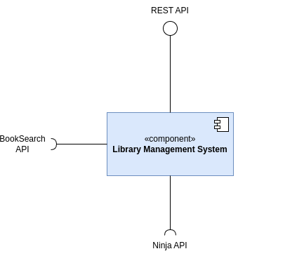
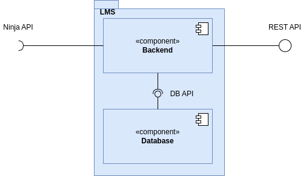
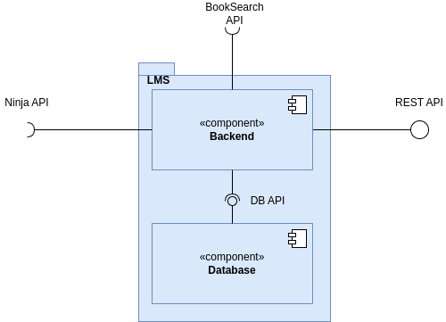
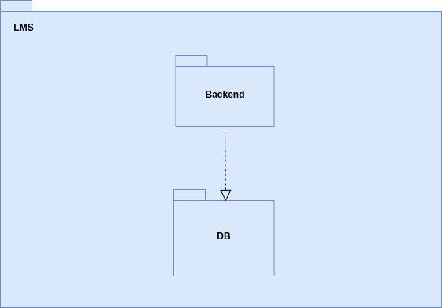
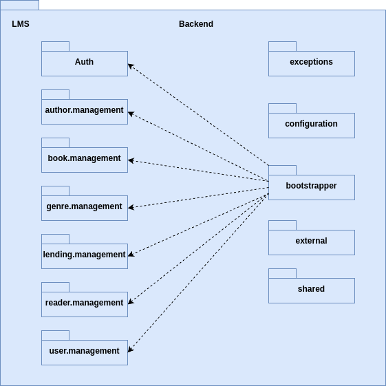
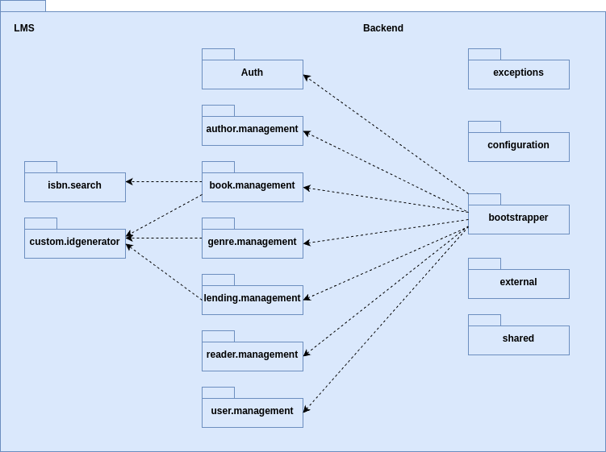
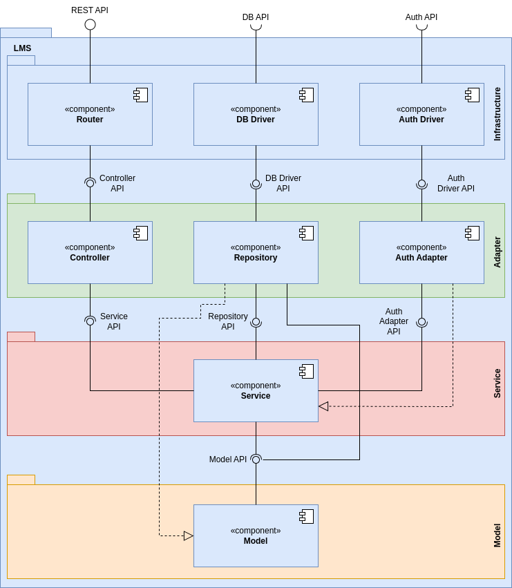
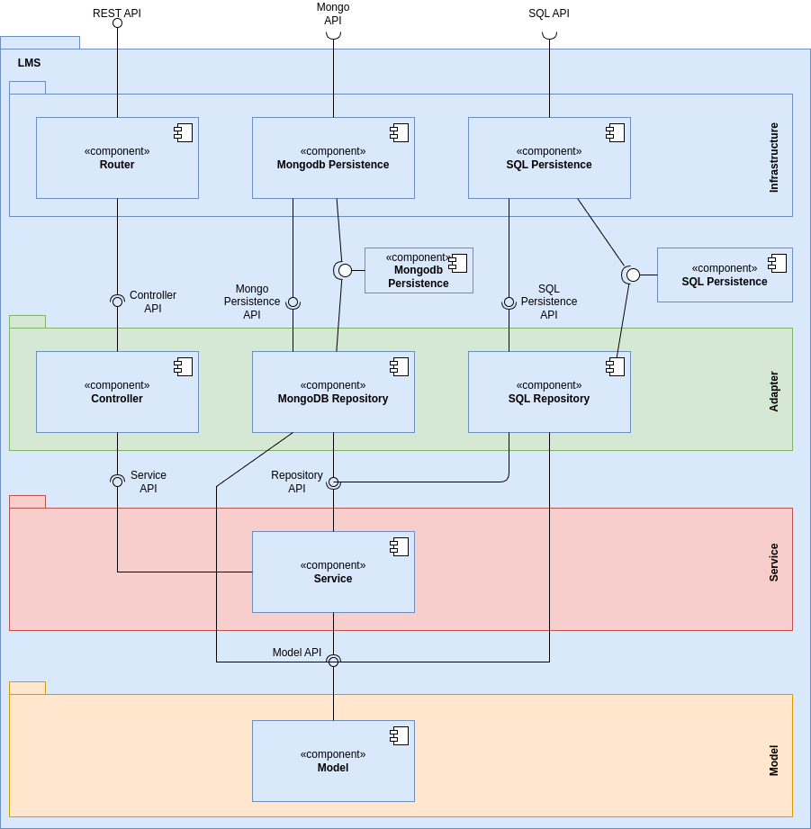

# Library Management System - Architectural Documentation

-----

## System Overview


The Library Management System (LMS) is a Spring Boot-based web application designed to manage a library's operations including book management, user management, lending operations, and reporting functionalities. The system supports different user roles (Librarians and Readers) with specific permissions and capabilities.

### Business Context
The system automates traditional library operations, allowing:
- **Librarians** to manage books, authors, readers, and lending operations
- **Readers** to browse available books and manage their lendings
- **System** to track lending history, calculate fines, and generate reports

### Key Stakeholders
- **Primary Users**: Librarians, Readers
- **Secondary Stakeholders**: Library Management, System Administrators
- **Development Team**: Software Architects, Developers, Testers

-----

## System-as-is (Reverse Engineering Design)

### Domain Model Analysis
Based on the reverse engineering of the codebase, the core domain consists of:

#### Aggregates Identified:
1. **User Aggregate**
   - Root: `User`
   - Entities: `Librarian`, `Reader`
   - Value Objects: Username, Password, Name

2. **Book Aggregate**
   - Root: `Book`
   - Entities: `Author`
   - Value Objects: `ISBN`, `Title`, `Description`

3. **Lending Aggregate**
   - Root: `Lending`
   - Entities: `Fine`
   - Value Objects: `LendingNumber`, dates

4. **Reader Details Aggregate**
   - Root: `ReaderDetails`
   - Value Objects: ReaderNumber, contact information

-----

## Architectural Views

---

### Physical View (Level 1)

#### Level 1 - Deployment View as is


---

#### Level 1 - Deployment View to be


---

### Logical View (Level 1)

#### Logical View (Level 1) as is


---

#### Logical View (Level 1) to be



---

### Physical View (Level 2)

#### Physical View (Level 2) as is


---

#### Physical View (Level 2) to be


---

### Logical View (Level 2)

#### Logical View (Level 2) as is



---

#### Logical View (Level 2) to be



---

### Implementation View (Level 2)

#### Implementation View (Level 2) as is


---

#### Implementation View (Level 2) to be



---

### Implementation View (Level 3)

#### Implementation View (Level 3) as is



---

#### Implementation View (Level 3) to be



---

### Logical View (Level 3)

#### Logical View (Level 3) as is



---

#### Logical View (Level 3) to be



-----

# Architectural Quality Requirements (ASR)

---

## System Overview

The **Library Management System (LMS)** is a backend service designed to handle core library operations. It exposes RESTful endpoints that allow managing:

- Books
- Genres
- Authors
- Readers
- Borrowing / loan records

The API enables full CRUD support and integration with external services for additional functionality.

---

## Current Problems

The existing system currently lacks the following capabilities:

### Extensibility
The architecture does not support easy expansion or addition of new features without significant code refactoring.

### Reliability
There are no strong mechanisms for fault handling, monitoring, service resilience, or automatic recovery.

### Flexible Data Persistence
The system does not support persistence across multiple database models.

### Configurability
System behavior cannot be easily adjusted at runtime and depends heavily on fixed configuration inside the codebase.

---

## Functional Requirements

The system must be capable of storing and managing data across different database technologies:

- **Relational Databases** — H2 / SQL
- **Document Databases** — MongoDB
- **In-memory Cache** — Redis

Additional requirements include:

- Retrieve ISBN information of books by title using third-party services *(Google Books API, Open Library API)*
- Generate unique identifiers in multiple formats based on given rules

---

## Non-Functional Requirements

### Performance
- Fast response time
- Redis must be used as the first lookup layer to reduce latency
- System should scale horizontally

### Security
- Authentication and authorization of users
- Ability to add additional users or permission rules on demand

### Extensibility
The system must allow new data types and features to be integrated without major architectural changes.

### Configurability
Configuration should be externalized in a config file — no code changes required.

### Reliability
Mechanisms must exist to recover from external service failures gracefully.

-----

## Requirements Classification

### Architectural Table

The requirements evaluation and prioritization were carried out based on software architecture criteria taught in the course.

| Capability | Description | Variability / Options | Stakeholder Impact | Occurrence | Risk Level | Priority |
|-----------|-------------|---------------------|------------------|------------|------------|---------|
| **Data Persistence** | Store application data across multiple database types based on configuration. | Configurable support for SQL + Redis or MongoDB + Redis. | Problems in persistence could compromise data integrity and system availability. | Regular | High | **4** |
| **ISBN Retrieval** | Retrieve a book's ISBN using its title from external services. | Configurable APIs: Google Books and Open Library Search. | Failures in API integration may affect book searches and creation, reducing usability. | Occasional | Low | **2** |
| **ID Generation** | Generate unique identifiers for entities in configurable formats without breaking existing functionality. | Supports multiple configurable ID generation strategies. | Failures could restrict clients needing specific ID formats. | Regular | Medium | **3** |


-----

# Attribute-Driven Design (ADD) Process

# Data Persistence Architecture

This document describes the **data persistence architecture** for the **Library Management System**.
The system has been redesigned to support **multiple data storage models** and **database management systems (DBMS)** in a **configurable and extensible way**.

---

## Quality Attribute Scenario

| Element | Statement |
|---------|-----------|
| **Stimulus** | Requirement to support various types of DBMS. |
| **Stimulus Source** | Stakeholders expect the application to adapt to different DBMS via configuration. |
| **Environment** | Supporting multiple DBMS for different stakeholders requires creating several persistence entities. |
| **Artifact** | Data persistence layer of the LMS. |
| **Response** | Implement interfaces for different DBMS, leveraging Spring Boot’s `@Profile` annotation for configuration. |
| **Response Measure** | Switching the data model and DBMS should be achievable in **setup** |

---

## Constraints

- The solution must be implemented using the existing REST service.
- Must support persistence in different data models and DBMS. Supported configurations include:

### Relational + In-Memory Caching
**Configuration:** `H2 + Redis`

**Description:**
This setup combines the **H2 relational database** with **Redis** as an **in-memory cache** layer.

| Component | Role |
|-----------|------|
| **H2 Database** | Primary relational storage for structured data. Ideal for local development and testing. |
| **Redis** | Caches frequently accessed data to improve performance. |

**Advantages:**
- Lightweight and fast — perfect for development environments.
- Reduces database calls with in-memory caching.
- Supports transactions and relational integrity.

**Typical Use Cases:**
- Local development and testing.
- Lightweight deployments with minimal persistence requirements.

---

### Document-Oriented + In-Memory Caching
**Configuration:** `MongoDB + Redis`

**Description:**
This configuration uses a **document-oriented NoSQL database (MongoDB)** together with **Redis** for caching.

| Component | Role |
|-----------|------|
| **MongoDB** | Stores flexible, JSON-like documents (ideal for evolving schemas). |
| **Redis** | Provides caching and key-value storage, reducing load on MongoDB and improving performance. |

**Advantages:**
- Supports dynamic, schema-less data structures.
- Excellent horizontal scalability and high availability.
- Redis caching improves throughput and response times.

**Typical Use Cases:**
- Production or cloud environments requiring scalable and flexible data models.
- Systems with large data volumes and varying entity structures.

---

## Concerns

- **Configuration Flexibility:** Switch between data persistence models without modifying code.
- **Maintainability & Extensibility:** Modular implementation allows easy addition of new DBMS.
- **Configuration Usability:** `application.properties` should be intuitive for fast and error-free adjustments.

---

## Technical Memo

### Problem
Supporting data persistence across multiple models (relational and document-based) and DBMS (SQL, MongoDB).

### Why Caching?
Database calls are expensive. When data rarely changes but is requested frequently, repeated database queries reduce performance.
**Solution:** Store static or frequently accessed data in Redis cache, reducing database calls and improving application performance.

### Solution Overview
- Configurable mechanism to support different data models and DBMS.
- Redis integration with both SQL and MongoDB.
- Two main persistence configurations selectable via setup or environment configuration.

### Key Considerations
- **Persistence Flexibility:** Support relational and document-based DBMS seamlessly.
- **Ease of Maintenance and Extension:** Modular design allows new DBMS addition via configuration.

---

## Configuration & Switching Between Models

### Setup
Define the desired persistence configuration in the application configuration file:

```properties
# Example in application.properties
# Default
spring.profiles.active=bootstrap
# or
spring.profiles.active=mongodb-redis
```

# ID Generation Architecture

This service **generates unique IDs for entities** in configurable formats. Different consumers or integrations may require different ID shapes. This service ensures **uniqueness, portability, and compliance** with various format specifications.

---

## Quality Attribute Scenario

| Element | Statement |
|---------|-----------|
| **Stimulus** | Requirement to generate IDs for entities in specific formats according to Stakeholders rules. |
| **Stimulus Source** | Stakeholders must define different ID formatting rules for various entities. |
| **Environment** | System uses the persistence layer’s native identifiers. |
| **Artifact** | The ID generation module and domain classes that include identifier attributes. |
| **Response** | Modify entity identifier attributes to use generated IDs and create an interface for ID generation methods, allowing multiple implementations and formats. The format used is configurable via setup. |
| **Response Measure** | Must be possible to switch the ID format in setup time. |

---

## Constraints

- The solution must be implemented on top of the existing REST service.
- The system must support multiple ID generation algorithms, including:

    1. `DIGIT_SUFFIX_TIMESTAMP` — uses the timestamp followed by a 6-digit numeric suffix.
    2. `TIMESTAMP_DIGIT_SUFFIX` — uses a 6-digit numeric suffix followed by the timestamp.

- Switching the ID generation format must be achievable via configuration **without modifying code**.
- Generated IDs must remain **unique** and compatible with consuming systems.

---

## Concerns

- **Configuration Flexibility:** The system should allow changing between ID formats via configuration without code changes.
- **Maintainability & Extensibility:** The implementation should be modular, making it easy to add new ID formats without affecting existing implementations.
- **Configuration Usability:** The ID format selection should be defined in setup.

---

## Technical Memo

### Problem
Ensure that the system can uniquely identify data independently while meeting Stakeholders-specific requirements.

### Solution
Develop an ID generation module that produces identifiers independent of the active persistence system, with support for multiple configurable formats.

### Key Considerations
- Supports future formats with minimal changes
- Can generate IDs in a distributed, safe, and performant manner

### Setup
Define the desired persistence configuration in the application configuration file:

```properties
# Example in application.properties
# Default
id.generation.strategy=DIGIT_SUFFIX_TIMESTAMP
# or
id.generation.strategy=TIMESTAMP_DIGIT_SUFFIX
```

# Book ISBN Retrieval

This service **retrieves a book’s ISBN by title** using configurable external APIs. Different integrations may require querying different sources. This service ensures **flexibility, reliability, and correct ISBN resolution** across multiple systems.

---

## Quality Attribute Scenario

| Element | Statement |
|---------|-----------|
| **Stimulus** | Requirement to obtain a book’s ISBN from external sources according to Stakeholders rules. |
| **Stimulus Source** | Stakeholders define which external systems to use for ISBN retrieval (e.g., Google Books, Open Library, ISBNdb). |
| **Environment** | System must query multiple external APIs and handle varying response formats and latencies. |
| **Artifact** | The Book ISBN retrieval module and book domain classes that include ISBN attributes. |
| **Response** | Implement a service that can query one or more external ISBN APIs and return the correct ISBN, abstracting API differences. The APIs to be used are configurable. |
| **Response Measure** | Must be possible to switch or combine external APIs via configuration without code changes. |

---

## Constraints

- The solution must integrate with the existing REST service.
- Supported external APIs for ISBN retrieval:

    1. Google Books API
    2. Open Library Search API
    3. ISBNdb (can be added in the future)

- API selection and combination must be configurable **without modifying code**.
- Retrieved ISBNs must remain **unique**.

---

## Concerns

- **Configuration Flexibility:** The system should allow switching between external APIs or combining them without changing code.
- **Maintainability & Extensibility:** Modular implementation allows easy addition of new external ISBN providers.
- **Reliability:** Handle API failures, timeouts, and inconsistent data from different sources.
- **Configuration Usability:** API URLs, keys, and timeouts should be clearly defined in configuration files.

---

## Technical Memo

### Problem
Retrieve a book’s ISBN reliably from external systems while supporting multiple APIs and combining them if necessary, without hardcoding API-specific logic.

### Solution
Implement an ISBN retrieval service that abstracts external APIs, supports configurable API selection, and returns accurate ISBNs.

### Key Considerations
- Supports multiple external providers (Google Books, Open Library, ISBNdb).
- Can combine results from multiple sources if required.
- Handles timeouts and failures gracefully.
- Easy to add future APIs.

### Setup
Define external API configuration in `application.properties`:

```properties
## External ISBN API Configuration
# Google Books API - API key optional but recommended
external.api.googlebooks.url=https://www.googleapis.com/books/v1
external.api.googlebooks.key=
# Open Library API - no key required
external.api.openlibrary.url=https://openlibrary.org
# Timeout for external API calls (in milliseconds)
external.api.timeout=5000
```

-----

# Tactics

The Library Management System (LMS) applies several software design tactics to ensure **modularity, maintainability, and flexibility**. These tactics guide how components interact, how responsibilities are separated, and how the system adapts to change.

---

## Encapsulation

- Sensitive data and internal logic are **hidden within classes** or modules.
- Each class is responsible for implementing the interface independently.

---

## Separation of Concerns

- Each module or layer in the system has a **single responsibility**.
- Promotes maintainability and easier reasoning about the system.

---

## Configurability & Flexibility

- The system is designed to **adapt behavior via configuration** rather than code changes.
- Examples: selecting ID generation strategy, switching between external ISBN APIs, or choosing the persistence database.
- Enables quick adaptation to Stakeholder needs without recompiling the system.

---

## Abstraction

- Interfaces and abstract classes are used to **decouple high-level modules from specific implementations**.
- Applied to **normalize behaviors shared across multiple classes**

---

## Testability & Extensibility

- Clear interfaces, abstractions, and encapsulated modules **simplify unit and integration testing**.
- New behaviors or components can be added by **extending existing abstractions** rather than modifying core logic.
- Reduces risk of breaking existing functionality while implementing new features.

---

## Use of Intermediaries

- Intermediary components act as **mediators between layers** or services, isolating dependencies.
- The actual implementation is selected in setup time, allowing the system to choose the most suitable setup for each Stakeholder context.
- **Key Advantages**: reduces direct coupling, improves testability, and makes components easier to replace or extend.

-----

# Reference Architectures

The system has characteristics inspired by **Clean Architecture** and **Modular Monolith principles**, although it does not fully implement this pattern.

## Layered and Modular Design

The project is structured similarly to a **Modular Monolith**, with clearly defined domain packages that aggregate related business components, services, controllers, and repositories.
This organization promotes logical separation of functional areas and demonstrates a clear intention to modularize within a single process.

**Limitations:**
- Modules still maintain significant dependencies on each other, creating noticeable coupling.
- Domain classes contain persistence logic, which increases the interconnection between layers and reduces isolation.
- As a result, the system behaves closer to a **traditional Layered Architecture** while retaining inspiration from modular principles.

---

## Clean Architecture Inspiration

The system follows several **Clean Architecture** concepts, such as separation of concerns and directing dependencies toward the domain.

**Limitations:**
- Domain entities are tightly coupled with persistence mechanisms (e.g., JPA annotations).
- The domain layer has direct dependencies on infrastructure components, limiting its independence.

---

### Spring Boot Reference Architecture
The system follows Spring Boot's recommended architecture patterns:

```
@Controller → @Service → @Repository → Database
     ↓           ↓           ↓
   DTOs    Domain Objects  Entities
```

### Domain-Driven Design Architecture
```
Application Layer (Services)
    ↓
Domain Layer (Entities, Value Objects, Domain Services)
    ↓
Infrastructure Layer (Repositories, External Services)
```

### RESTful Web Services Architecture
```
Client → HTTP → Controller → Service → Repository → Database
   ↑                ↓
JSON/XML        DTOs/Views
```
-----

# Design Patterns

The Library Management System leverages several well-known design patterns to ensure **flexibility, maintainability, and scalability**.

---

## Strategy Pattern

The **Strategy Pattern** is employed to allow the selection of different behaviors at runtime. Examples include:

- Choosing the ID generation.
- Selecting the target database for persistence data.
- Retrieve a book ISBN by title.

**Key Advantages:**
- Enables multiple interchangeable strategies encapsulated in separate classes.
- Allows the active strategy to be determined via configuration, supporting **variability without code changes**.
- Facilitates future extensions by adding new strategies without impacting existing ones.

---

## Repository Pattern

The system implements the **Repository Pattern**, using repositories as intermediaries between the **business logic** and the **data storage layer**.

**Key Advantages:**
- Provides a structured and consistent way to access, manage, and manipulate data.
- Abstracts the underlying storage technology, enabling easier replacement or addition of new databases.
- Promotes **clear separation of concerns**, making the system more maintainable and testable.
- Simplifies adapting the system to new persistence mechanisms without modifying business logic.

---

## Factory Pattern

The system also uses the **Factory Pattern** to manage object creation dynamically.

**Key Advantages:**
- Encapsulates complex object creation logic.
- Decouples the client from specific implementations, allowing the system to **instantiate the appropriate class at runtime**.
- Enhances flexibility and extensibility, as new implementations can be added without modifying the Stakeholder code.
- Supports configuration-driven behavior, enabling dynamic adaptation based on environment or requirements.

-----

## Design Alternatives

### Event-Driven Architecture (EDA)

An **Event-Driven Architecture (EDA)** was considered as an alternative design approach for the system.
In this model, components communicate by producing and consuming **events**, rather than calling each other directly.

**Potential Benefits:**
- **Dependency:** Services do not depend on each other directly, improving modularity and flexibility.
- **Scalability:** Event streams can be processed asynchronously, allowing the system to handle higher loads efficiently.
- **Extensibility:** New features or services can subscribe to existing events without modifying the existing components.
- **Responsiveness:** Enables reactive and near real-time processing of actions and changes in the system.

**Potential Drawbacks:**
- **Complexity:** Introducing event brokers, queues, or streams adds architectural and operational complexity.
- **Debugging & Observability:** Tracing the flow of events can be more challenging than in synchronous systems.
- **Consistency:** Ensuring eventual consistency may require careful design of transactions and state handling.
- **Overhead:** For smaller systems, EDA might be overkill compared to simpler, synchronous architectures.

**Conclusion:**
While EDA provides scalability, flexibility, and loose coupling, the current system opted for a **modular monolith with layered principles**, balancing simplicity with modularity and maintainability.