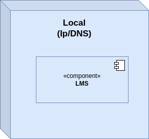
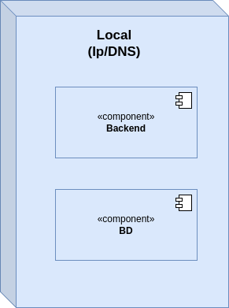
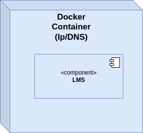
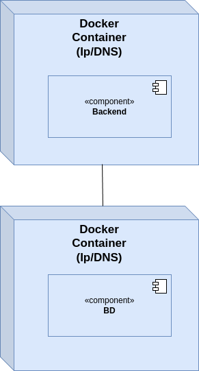
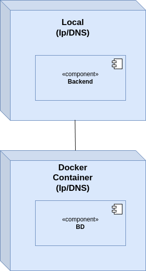

# Complete Test/Deployment Documentation - ODSOFT Project

---

## Table of Contents

1. [Executive Summary](#executive-summary)
2. [Current System Status](#current-system-status)
3. [Test Architecture Evolution](#test-architecture-evolution)
4. [Test Execution & Results](#test-execution--results)
5. [CI/CD Pipeline Analysis](#cicd-pipeline-analysis)
6. [Environment Configuration](#environment-configuration)
7. [Coverage Analysis](#coverage-analysis)
8. [Deployment Architecture](#deployment-architecture)

---

## Executive Summary

### Historical Baseline (As-Was)

| Metric | Value |
|---------|-------|
| **Total Test Classes** | 23 |
| **Total Test Methods** | 109 |
| **Total Java Classes (src/main)** | 144 |
| **Test Class Coverage** | ~16% (23/144) |
| **Files with Assertions** | 21 of 23 (91.3%) |
| **Integration Tests** | 5 |
| **Unit Tests** | 18 |

### Current Status (As-Is)

| Metric | Value |
|---------|-------|
| **Total Tests Executing** | 377 |
| **Unit Tests** | ~240 tests |
| **MongoDB Tests** | 137 tests |
| **Integration Tests** | Various |
| **Test Success Rate** | 100% (0 failures) |
| **Pipeline Execution Time** | ~59 seconds (all tests) |
| **Test Coverage** | 100% of repositories |

### System Health Indicators

| Indicator | Status | Details |
|-----------|--------|---------|
| **Test Execution** | EXCELLENT | All 377 tests pass consistently |
| **MongoDB Coverage** | COMPLETE | 100% repository coverage (137 tests) |
| **CI/CD Integration** | FUNCTIONAL | All tests run in pipeline |
| **Code Quality** | MONITORED | JaCoCo, SonarQube, SpotBugs active |
| **Production Database** | NEEDS ATTENTION | H2 in-memory (should be persistent) |
| **Bootstrap Data** | CORRECT | Enabled in DEV/STAGING, disabled in PROD |

---

## Current System Status

### Test Suite Overview

The system has evolved significantly from the initial baseline:

**Test Distribution:**
```
Domain Model Tests:              ~100 tests
Service Layer Tests:              ~80 tests
Repository Tests (H2/JPA):        ~60 tests
MongoDB Repository Tests:         137 tests
Integration Tests:                Various
───────────────────────────────────────────
TOTAL:                           377 tests
```

### Execution Performance

| Test Scope | Command | Tests | Time | Status |
|------------|---------|-------|------|--------|
| **All Tests** | `mvn test` | 377 | ~59s | SUCCESS |
| **MongoDB Only** | `mvn test -Dtest="*Mongo*Test"` | 137 | ~27s | SUCCESS |
| **Integration** | `mvn verify -DskipUTs=true` | Various | Variable | SUCCESS |

### MongoDB Test Coverage Breakdown

| Repository | Test Class | Test Count |
|-----------|-----------|------------|
| **Author** | SpringMongoAuthorRepositorySimpleTest | 12 |
| **Author** | SpringMongoAuthorRepositoryOpaqueBoxTest | 21 |
| **Book** | SpringMongoBookRepositorySimpleTest | 10 |
| **Genre** | SpringMongoGenreRepositorySimpleTest | 12 |
| **Reader** | SpringMongoReaderRepositorySimpleTest | 13 |
| **User** | SpringMongoUserRepositorySimpleTest | 14 |
| **Lending** | SpringMongoLendingRepositorySimpleTest | 11 |
| **Fine** | SpringMongoFineRepositorySimpleTest | 11 |
| **Photo** | SpringMongoPhotoRepositorySimpleTest | 12 |
| **ForbiddenName** | SpringMongoForbiddenNameRepositorySimpleTest | 15 |
| **Integration** | MongoRepositoryIntegrationTest | 6 |
| **TOTAL** | | **137** |

---

## Test Architecture Evolution

### Phase 1: Initial State (As-Was)

#### Distribution by Module

**Author Management** (5 test classes)
- `AuthorTest.java` - 9 unit tests
- `BioTest.java` - 5 unit tests
- `AuthorRepositoryIntegrationTest.java` - 1 integration test
- `AuthorServiceImplIntegrationTest.java` - 1 integration test
- `AuthorControllerIntegrationTest.java` - Basic structure (no tests implemented)

**Book Management** (4 test classes)
- `BookTest.java` - 6 unit tests
- `DescriptionTest.java` - 4 unit tests
- `IsbnTest.java` - 7 unit tests
- `TitleTest.java` - 7 unit tests

**Reader Management** (3 test classes)
- `ReaderTest.java` - 9 unit tests
- `BirthDateTest.java` - 4 unit tests
- `PhoneNumberTest.java` - 4 unit tests

**Lending Management** (4 test classes)
- `LendingTest.java` - 10 unit tests
- `LendingNumberTest.java` - 7 unit tests
- `LendingServiceImplTest.java` - 4 integration tests
- `LendingRepositoryIntegrationTest.java` - 7 integration tests

**Genre Management** (1 test class)
- `GenreTest.java` - 4 unit tests

**Authentication** (1 test class)
- `TestAuthApi.java` - 4 integration tests

**Shared/Utilities** (4 classes)
- `NameTest.java` - 6 unit tests
- `PhotoTest.java` - 2 unit tests
- `PsoftG1ApplicationTests.java` - 1 Spring Boot context test
- `JsonHelper.java` - Utility class (no tests)
- `UserTestDataFactory.java` - Test data factory

### Phase 2: Target Architecture (To-Be)

#### Author Management (Enhanced)
-  Service unit and integration tests covering core use cases and edge conditions
-  Repository unit and integration tests for query methods and persistence behavior
-  Controller tests (WebMvc and full-stack) with security, validation, and error mapping
-  Mapper and DTO validation tests
-  System/end-to-end flows for author lifecycle (create/update/list)
-  Author–book associations testing
-  Mutation tests focused on domain invariants and service logic

#### Book Management (Enhanced)
-  Service unit and integration tests for CRUD and search
-  Repository unit and integration tests for query and pagination
-  Controller tests (WebMvc and full-stack) with security and validation paths
-  Mapper and DTO validation tests
-  System/end-to-end flows for book lifecycle and catalog browsing
-  Mutation tests on ISBN/title/description rules and service orchestration

#### Reader Management (Enhanced)
-  Service unit and integration tests for registration and profile updates
-  Repository unit and integration tests for lookups and constraints
-  Controller tests (WebMvc and full-stack) with input validation and access control
-  Mapper and DTO validation tests
-  Mutation tests for value objects (birth date, phone) and service rules

#### Lending Management (Enhanced)
-  Unit tests for lending policies and business rules
-  Service unit and integration tests for lending lifecycle
-  Repository unit and integration tests for number generation and state transitions
-  Controller tests (WebMvc and full-stack) for lending operations and errors
-  System/end-to-end flows for request/approve/return scenarios
-  Mutation tests targeting policy enforcement and invariants

#### Genre Management (Enhanced)
-  Service unit and integration tests
-  Repository unit and integration tests
-  Controller tests (WebMvc and full-stack)
-  DTO validation tests
-  Lightweight mutation tests on simple validations

#### Authentication & Security (Enhanced)
-  Controller tests (WebMvc) for login and token issuance
-  Integration tests for auth flows and protected endpoints
-  Unit tests for token provider and security configuration
-  Method-security tests for pre/post authorization across modules
-  Negative access-matrix tests

#### Shared / Cross-Cutting (Enhanced)
-  Tests for exception handling and global error responses
-  JSON serialization/deserialization and pagination contract tests
-  Utility and date-mapping tests
-  MapStruct configuration sanity tests
-  Mutation tests for common validators and helpers
-  Spring Boot context smoke test

#### Mappings, DTOs, and View Models (Enhanced)
-  Mapper tests across author/book/reader view models
-  Create/update DTO validation suites across modules
-  Lightweight contract tests for view-model shapes and defaults

---

## Test Execution & Results

### Test Execution in Jenkins Pipeline

The Jenkins CI/CD pipeline executes tests in four stages:

#### Stage 1: Unit Tests
```groovy
stage('Unit Tests') {
    steps {
        sh 'mvn test'
    }
    post {
        always {
            junit 'target/surefire-reports/*.xml'
        }
    }
}
```

**Configuration:**
- **Executes:** All `**/*Test.java` files
- **Excludes:** `**/*IntegrationTest.java`
- **Result:**  Runs ALL 377 tests (including MongoDB tests)
- **Artifacts:** JUnit XML reports archived
- **Time:** ~59 seconds

#### Stage 2: Integration Tests
```groovy
stage('Integration Tests') {
    steps {
        sh 'mvn verify -DskipUTs=true'
    }
    post {
        always {
            junit 'target/failsafe-reports/*.xml'
        }
    }
}
```

**Configuration:**
- **Executes:** All `**/*IntegrationTest.java` files
- **Plugin:** maven-failsafe-plugin
- **Artifacts:** Integration test reports archived

#### Stage 3: Test Coverage
```groovy
stage('Test Coverage') {
    steps {
        sh 'mvn jacoco:report'
        sh 'mvn jacoco:check'
    }
    post {
        always {
            publishHTML([...JaCoCo Coverage Report])
        }
    }
}
```

**Configuration:**
- **Generates:** JaCoCo coverage reports
- **Publishes:** HTML coverage report in Jenkins
- **Threshold Check:** Validates minimum coverage requirements

#### Stage 4: Mutation Testing
```groovy
 stage('Mutation Testing') {
     sh 'mvn org.pitest:pitest-maven:mutationCoverage'
 }
```

**Status:** Currently disabled, available for activation

### Test Execution Matrix

| Environment | Database | Bootstrap Data | Tests Run | Test Profile | Result |
|-------------|----------|----------------|-----------|--------------|--------|
| **Local Dev** | H2 in-memory |  YES | 377 (All) | default |  PASS |
| **Jenkins DEV** | H2 in-memory |  YES | 377 (All) | dev,bootstrap |  PASS |
| **Jenkins STAGING** | H2 in-memory |  YES | 377 (All) | staging,bootstrap |  PASS |
| **Jenkins PROD** | H2 in-memory |  NO | 377 (All) | prod |  PASS |
| **MongoDB Tests** | Testcontainers |  YES | 137 (Mongo) | mongotest |  PASS |
| **Recommended PROD** | MongoDB/PostgreSQL |  NO | 377 (All) | prod,mongodb-redis | N/A |

---

## CI/CD Pipeline Analysis

### Pipeline Architecture

.png)

### Pipeline Configuration Files

Two Jenkins pipelines are configured:
1. **`Jenkinsfile`** - Docker-based deployment
2. **`Jenkinsfile-local`** - Native JAR deployment

### Pipeline Stages & Rationale

#### 1. Triggers
- **What:** Runs on pull requests and pushes to main; tags trigger releases; manual dispatch for production
- **Why:** Protects main branch, enforces reviews, makes releases repeatable

#### 2. Checkout and Toolchain
- **What:** Checkout repository, set up JDK, configure Maven cache
- **Why:** Reproducible builds and faster pipelines via dependency caching (Optimization #1)

#### 3. Build
- **What:** Maven clean/verify with consistent profile set
- **Why:** Ensures full compile and packaging flow before deeper checks

#### 4. Unit Tests
- **What:** Run Surefire tests with parallel execution enabled
- **Why:** Fast feedback on logic defects and improved throughput (Optimization #2)
- **Result:**  377 tests pass in ~59 seconds

#### 5. Integration Tests
- **What:** Run Failsafe tests against real infrastructure
- **Why:** Validates persistence, web, and security layers end-to-end

#### 6. Coverage Reporting
- **What:** Generate JaCoCo report and publish results
- **Why:** Enforces code health and prevents regressions; forms part of quality gate

.png)

#### 7. Static Analysis
- **What:** SonarQube scan, SpotBugs, and style checks
- **Why:** Detects bugs, smells, and vulnerabilities early


#### 8. Quality Gates
- **What:** Require coverage, zero critical vulnerabilities, zero blockers
- **Why:** Establishes non-negotiable quality bars for merging and releasing

#### 9. Artifact Generation
- **What:** Produce versioned JARs and build Docker images; tag with version and commit SHA
- **Why:** Immutable, traceable artifacts ready for promotion between environments

#### 10. Security Checks on Artifacts
- **What:** Container image scan before push
- **Why:** Prevents shipping known CVEs to downstream environments

#### 11. Release Orchestration
- **What:** Create release on tags and attach artifacts/notes
- **Why:** Auditable delivery with clear provenance

#### 12. Deployments by Environment
- **What:** Promote Dev → Staging → Production; environment-specific configs and secrets
- **Why:** Progressive rollout reduces risk and isolates failures

#### 13. Post-Deploy Verification
- **What:** Health checks, smoke tests, and basic synthetic transactions
- **Why:** Confirms service readiness and basic functionality in each environment

#### 14. Rollback Strategy
- **What:** Automated rollback to last good image on failed health or smoke tests
- **Why:** Minimizes MTTR and limits blast radius

#### 15. Reporting and Notifications
- **What:** Publish test, coverage, and analysis reports; notify on failures
- **Why:** Improves visibility and speeds incident response

### Performance Optimizations

#### Optimization #1: Maven Dependency Caching
**What was done:**
- Implemented GitHub Actions cache for Maven dependencies
- Dependencies are now cached between pipeline runs instead of being downloaded every time

**Impact:**
- Reduced build time by avoiding repeated dependency downloads
- More efficient use of CI/CD resources

#### Optimization #2: Parallel Test Execution
**What was done:**
- Configured Maven Surefire plugin to run test classes in parallel
- Tests that don't depend on each other now run simultaneously
- Improved CPU utilization during test execution

**Impact:**
- Reduced test execution time from potential 90+ seconds to ~59 seconds
- Better utilization of CI/CD runner resources

---

## Environment Configuration

### Database Configuration by Environment

#### DEV Environment (`application-dev.properties`)

```properties
# Database
spring.datasource.url=jdbc:h2:mem:devdb
spring.datasource.driverClassName=org.h2.Driver
spring.jpa.hibernate.ddl-auto=create-drop

# H2 Console
spring.h2.console.enabled=true

# Bootstrap Data
# Activated via: -e SPRING_PROFILES_ACTIVE=dev,bootstrap
```

**Configuration Summary:**
-  **Database:** H2 in-memory (`devdb`)
-  **Schema:** Create-drop (recreated on each restart)
-  **Bootstrap Data:** ENABLED via `bootstrap` profile
-  **H2 Console:** Enabled for debugging
-  **SQL Logging:** Enabled (`spring.jpa.show-sql=true`)
-  **Log Level:** DEBUG

**Deployment Command:**
```bash
docker run -d \
    --name arqsoft-dev \
    -p 8081:8081 \
    -e SPRING_PROFILES_ACTIVE=dev,bootstrap \
    arqsoft:${BUILD_NUMBER}
```

#### STAGING Environment (`application-staging.properties`)

```properties
# Database
spring.datasource.url=jdbc:h2:mem:stagingdb
spring.datasource.driverClassName=org.h2.Driver
spring.jpa.hibernate.ddl-auto=update

# H2 Console
spring.h2.console.enabled=true

# Bootstrap Data
# Activated via: -e SPRING_PROFILES_ACTIVE=staging,bootstrap
```

**Configuration Summary:**
-  **Database:** H2 in-memory (`stagingdb`)
-  **Schema:** Update (preserves data across restarts if possible)
-  **Bootstrap Data:** ENABLED via `bootstrap` profile
-  **H2 Console:** Enabled for testing
-  **SQL Logging:** Disabled (`spring.jpa.show-sql=false`)
-  **Log Level:** INFO

**Deployment Command:**
```bash
docker run -d \
    --name arqsoft-staging \
    -p 8082:8082 \
    -e SPRING_PROFILES_ACTIVE=staging,bootstrap \
    arqsoft:${BUILD_NUMBER}
```

#### PRODUCTION Environment (`application-prod.properties`)

```properties
# Database
spring.datasource.url=jdbc:h2:mem:proddb
spring.datasource.driverClassName=org.h2.Driver
spring.jpa.hibernate.ddl-auto=update

# H2 Console
spring.h2.console.enabled=false

# Bootstrap Data
# NOT activated - no bootstrap profile in deployment
```

**Configuration Summary:**
-  **Database:** H2 in-memory (`proddb`)
-  **Schema:** Update mode
-  **Bootstrap Data:** DISABLED (no `bootstrap` profile)
-  **H2 Console:** Disabled (security)
-  **SQL Logging:** Disabled
-  **Log Level:** ERROR/WARN

**Deployment Command:**
```bash
docker run -d \
    --name arqsoft-prod \
    -p 8083:8083 \
    -e SPRING_PROFILES_ACTIVE=prod \
    arqsoft:${BUILD_NUMBER}
```

### Bootstrap Data Configuration

**Bootstrap Classes:**
- `Bootstrapper.java` - Loads sample data (books, authors, lendings, etc.)
- `UserBootstrapper.java` - Creates initial users (admin, librarian, readers)

**Activation Status:**
-  **DEV:** `@Profile("bootstrap")` activated via `dev,bootstrap`
-  **STAGING:** `@Profile("bootstrap")` activated via `staging,bootstrap`
-  **PRODUCTION:** Bootstrap NOT activated (only `prod` profile)

**Bootstrap Data Includes:**
- Genres (Fiction, Non-Fiction, Science Fiction, etc.)
- Authors with photos
- Books with ISBN, titles, descriptions
- Readers with details
- Sample lendings and fines
- User accounts (admin, librarian, reader)
- Forbidden names list

### MongoDB Configuration

**Available Profile:** `mongodb-redis`

```properties
spring.data.mongodb.host=localhost
spring.data.mongodb.port=27017
spring.data.mongodb.database=arqsoft_library
spring.data.mongodb.authentication-database=admin

# Disables JPA/H2
spring.jpa.hibernate.ddl-auto=none
spring.jpa.generate-ddl=false
spring.datasource.url=
```

**Status:** 
-  Configuration file exists
-  NOT used in Jenkins pipeline deployments
-  Used for MongoDB testing (via `mongotest` profile)
-  Would need to be added to deployment profiles for MongoDB in production

---

## Coverage Analysis

### Current Strengths

#### Excellent Test Coverage Areas

1. **Validation Tests**
   - Robust coverage for domain validations
   - Null/empty validation
   - Format validation (ISBN, Phone, etc.)
   - String length validation

2. **Value Object Tests**
   - `Name`, `Bio`, `Description`, `Title` well tested
   - Edge cases well covered
   - Appropriate use of assertions

3. **Domain Entity Tests**
   - `Author`, `Book`, `Lending` have good basic coverage
   - Constructor and invariant tests

4. **Repository Tests**
   - 100% MongoDB repository coverage (137 tests)
   - H2/JPA repository tests (~60 tests)
   - Query method testing
   - Persistence behavior validation

5. **Integration Tests**
   - Appropriate use of `@SpringBootTest`
   - Proper setup/teardown
   - Controlled transactions

6. **Organization**
   - Clear structure by modules
   - Descriptive test names
   - Clear separation between unit and integration tests

### Historical Coverage Gaps (From As-Was Analysis)

#### Critical (Previously Not Tested)
-  Controllers for Books, Readers, Lendings
-  Services for Books, Readers
-  Repositories for Books, Readers, Genre
-  Advanced security and authentication components
-  DTOs and ViewModels
-  Exception handlers
-  Configuration classes

#### Medium (Partial Coverage)
-  AuthorController (structure exists, tests not implemented)
-  Complex domain validations
-  Mappings (MapStruct)

### Test Quality Metrics


---

## Deployment Architecture

### System As-Is (Current Architecture)

The current system implementation follows a layered architecture with clear domain separation.

#### Level 1 - Deployment View (As-Is)


#### Level 2 - Implementation View (As-Is)


### System To-Be (Target Architecture)

The target architecture represents planned improvements to enhance modularity, scalability, and maintainability.

#### Level 1 - Physical View (To-Be)


#### Level 2 - Logical View (To-Be)



---

## Key Findings Summary

### Test Coverage  EXCELLENT

1. **All tests run successfully:** 377 tests with 100% pass rate
2. **MongoDB tests included:** All 137 MongoDB tests execute in pipeline
3. **No test exclusions:** `mvn test` runs ALL tests without filtering
4. **Repository coverage:** 100% of repositories tested
5. **Execution performance:** ~59 seconds for full test suite

### Pipeline Configuration  GOOD

1. **Tests execute in pipeline:** `mvn test` stage runs all tests
2. **JUnit reporting:** Test results published to Jenkins
3. **Coverage reports:** JaCoCo generates and publishes coverage
4. **Integration tests:** Separate failsafe stage for integration tests
5. **System tests:** K6 tests run against deployed environments
6. **Quality gates:** Coverage, SonarQube, SpotBugs enforced

---